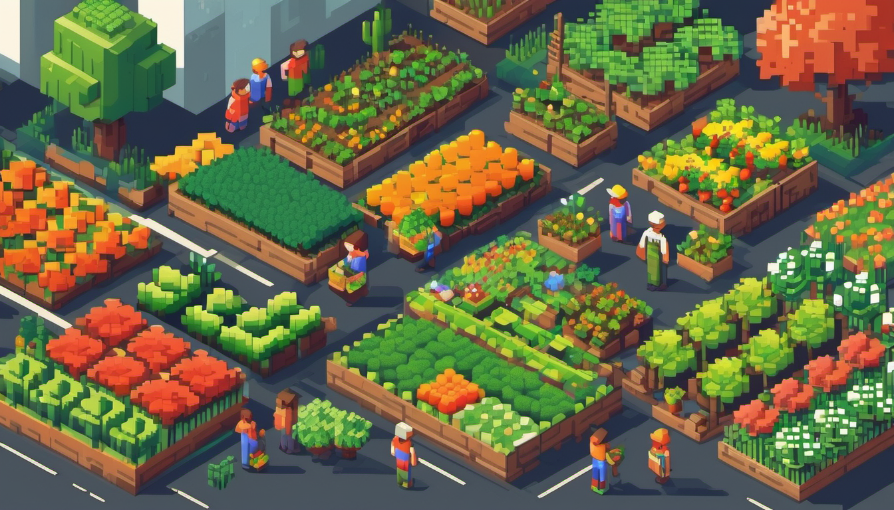
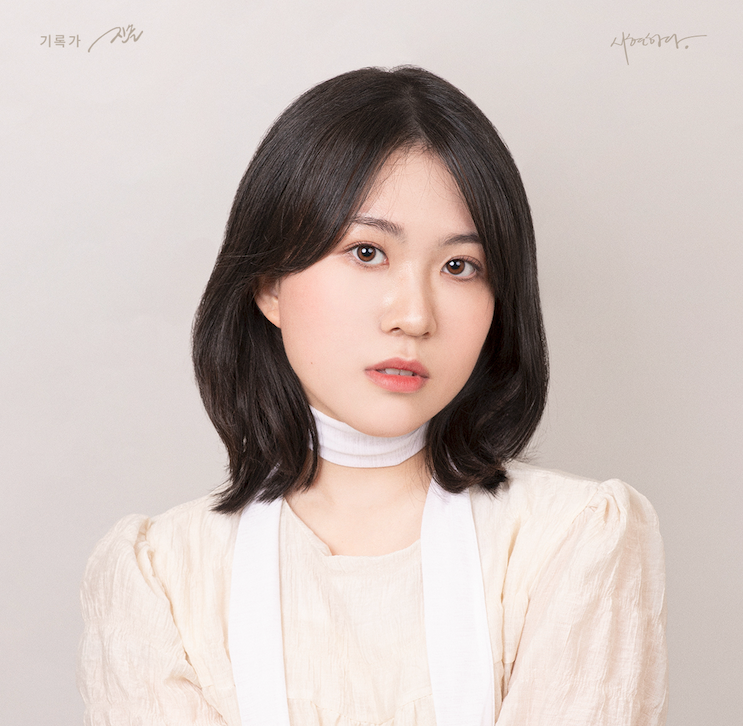

# FarmWorld

</img>

## Introduction
Our 'Picks and Shovel' team participates in the **23-24 Google Solution Challenge**. We supports urban farmers and develops applications that encourage urban agriculture.

The purpose of our application is to provide useful tips and information to beginners in urban farming and to provide a platform for experienced urban farmers to share their knowledge.

The team's goal is to contribute to creating a 'Sustainable Cities and Communities' through urban agriculture and to enable many people to enjoy happiness in a better environment.

## Team "Picks-and-Shovels" 


### Members  

이재승|강혜린|하선웅|홍현민
:-:|:-:|:-:|:-:
</img>|</img>|</img>|</img>
[Github](https://github.com/js0807)|[Github](https://github.com/hyerinkang)|[Github](https://github.com/devnok)|[Github](https://github.com/HyunminHong619)

### Contribution  

- [`이재승`](https://github.com/js0807) : PM, ML/DL Part
    - Presentation, Schedule management, Notion management, Submission form creation
- [`강혜린`](https://github.com/hyerinkang) : Front, Design
    - Presentation planning, Screen composition
- [`하선웅`](https://github.com/devnok) : Front, Server
    - User story writing, Screen composition, Discord/Github management
- [`홍현민`](https://github.com/HyunminHong619) : Server
    - Writing meeting minutes, Organizing functions


## Project Outline

### Outline

* Goals
    * .
* Functions
    * Virtual Farm
        * Diary
        * Character ~
        * Crop recommendation
    * Community
        * Post recommendation

### Architecture


## Demo

### Demo Video


## 🚀 Architecture
```
(example : farm-world-ml)
.
├── LICENSE
├── README.md
├── disease_detection
│   ├── image
│   │   ├── apple_cedar_apple_rust.jpg
│   │   ├── apple_healthy.jpg
│   │   ├── grape_healthy.jpg
│   │   ├── raspberry_healthy.jpg
│   │   └── strawberry_leaf_scorch.JPG
│   └── pred.py
├── recommendation
│   ├── data
│   │   ├── board.csv
│   │   ├── board_read_like.csv
│   │   ├── board_tag.csv
│   │   ├── farm.csv
│   │   ├── tag.csv
│   │   └── user.csv
│   ├── ipynb
│   │   ├── matrix_factorization.ipynb
│   │   ├── recommend.ipynb
│   │   └── recommend_crop.ipynb
│   ├── making_csv
│   │   ├── board_csv.py
│   │   ├── board_read_like_csv.py
│   │   ├── board_tag_csv.py
│   │   ├── farm_csv.py
│   │   └── user_csv.py
│   ├── recommend_crop.py
│   └── recommend_post.py
├── requirements.txt
└── setup.sh
```

## How to Use

```bash
# 프로젝트 다운로드
git clone https://github.com/Picks-and-Shovels/farm-world-front
```

## Docker
```
.
```