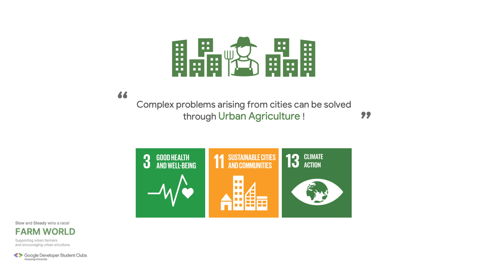

# FarmWorld

</img>

## Introduction
Our 'Picks and Shovel' team participates in the **23-24 Google Solution Challenge**. We supports urban farmers and develops applications that encourage urban agriculture.

The purpose of our application is to provide useful tips and information to beginners in urban farming and to provide a platform for experienced urban farmers to share their knowledge.

The team's goal is to contribute to creating a 'Sustainable Cities and Communities' through urban agriculture and to enable many people to enjoy happiness in a better environment.

## Team "Picks-and-Shovels" 


### Members  

이재승|강혜린|하선웅|홍현민
:-:|:-:|:-:|:-:
</img>|</img>|</img>|</img>
[Github](https://github.com/js0807)|[Github](https://github.com/hyerinkang)|[Github](https://github.com/devnok)|[Github](https://github.com/HyunminHong619)

### Contribution  

- [`이재승`](https://github.com/js0807) : PM, ML/DL Part
    - Presentation, Schedule management, Notion management, Submission form creation
- [`강혜린`](https://github.com/hyerinkang) : Front, Design
    - Presentation planning, Screen composition
- [`하선웅`](https://github.com/devnok) : Front, Server
    - User story writing, Screen composition, Discord/Github management
- [`홍현민`](https://github.com/HyunminHong619) : Server
    - Writing meeting minutes, Organizing functions


## Project Outline

### Outline

* Diary Page
    * Write Diary
    * View Diary
* Community Page
    * Posting
    * Likes, Views

### Architecture

</img>

## Demo

### Demo Video

- Video Link : https://youtu.be/NAc1R1lS3x4

## How to Use

```bash
# server setting
git clone https://github.com/Picks-and-Shovels/farm-world-server.git
cd farm-world-server
npm install
npm run start:dev

# how to run app
git clone https://github.com/Picks-and-Shovels/farm-world-app
cd farm-world-app
npm install
npm run dev
```
